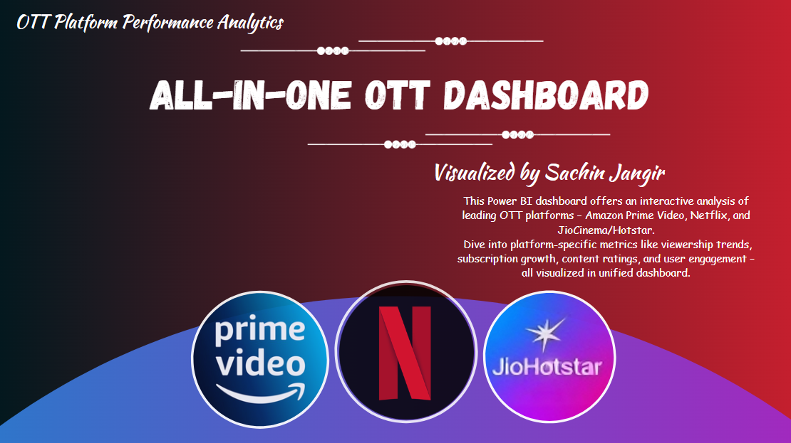
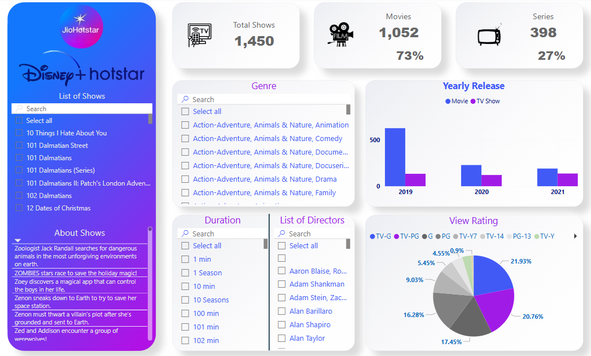
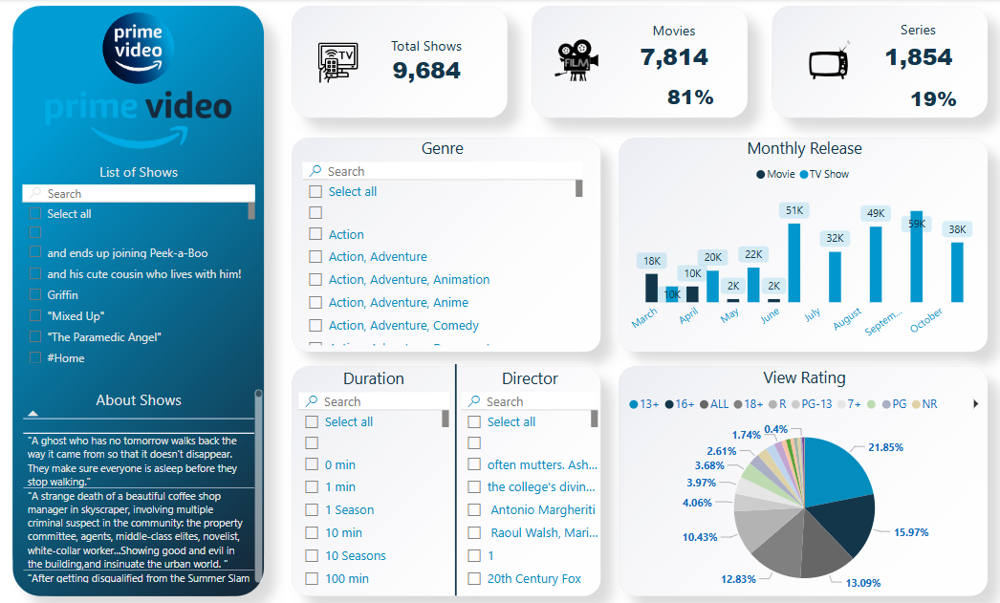

<h1 align="center">📊 All-in-One OTT Dashboard</h1>

  <b>OTT Platform Performance Analytics Dashboard using Power BI</b> 
  Visualized by <a href="https://github.com/DataAnalystSachin">Sachin Jangir</a>

---

## 🔍 Overview

This Power BI dashboard provides a comprehensive and interactive analysis of major OTT platforms:
- **Amazon Prime Video**
- **Netflix**
- **Disney+ Hotstar (JioCinema)**

Explore platform-specific insights such as:
- 📈 **Viewership Trends**
- 🎬 **Movie vs. Series Distribution**
- 🎯 **Genre Classification**
- 🕒 **Content Duration**
- 🌟 **View Ratings**
- 📅 **Yearly/Monthly Releases**
- 🏆 **Awards Received** (Netflix)

The dashboard aims to assist in understanding user preferences, platform performance, and content characteristics in a unified visual format.

---

## 🖼️ Dashboard Snapshots

### 🏠 Home Dashboard

### 🔴 Netflix Dashboard

### 🔵 Disney+ Hotstar Dashboard

### 🔷 Amazon Prime Video Dashboard

---

## 💡 Key Features

- ✅ Filterable data by **Genre**, **Director**, **Duration**, and **Rating**
- 📊 Distinction between **Movies** and **Series**
- 📆 Interactive charts for **Yearly/Monthly** release patterns
- 🏆 Netflix-specific breakdown of **Awards received**
- 🌐 Unified design across all platforms for easy comparison

---

## 🛠️ Built With

- **Microsoft Power BI**
- **Power Query** for data transformation
- **DAX** for calculated measures and KPIs
- **Custom Visuals** for interactive insights

---

## 📁 Repository Contents

- `homeOTT.png` – All-in-one summary page
- `Netfilix.png` – Netflix insights
- `Jio Hotstar.png` – Disney+ Hotstar performance
- `Amazon prime video.png` – Amazon Prime Video analytics

---

## 🔗 Live Preview

> 🟢 *Live dashboard preview link coming soon…*

---

## 🙌 Connect With Me

📧 Email: [sachinjangir204@gmail.com](mailto:sachinjangir204@gmail.com)  
🔗 GitHub: [DataAnalystSachin](https://github.com/DataAnalystSachin)  
🌍 Location: Rajasthan, India

---

⭐ **If you like this project, please give it a star!**
